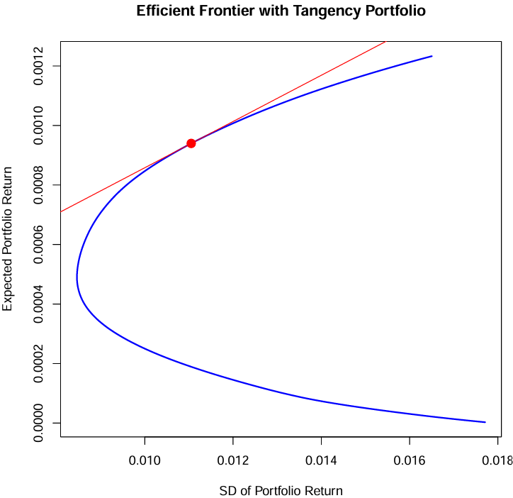
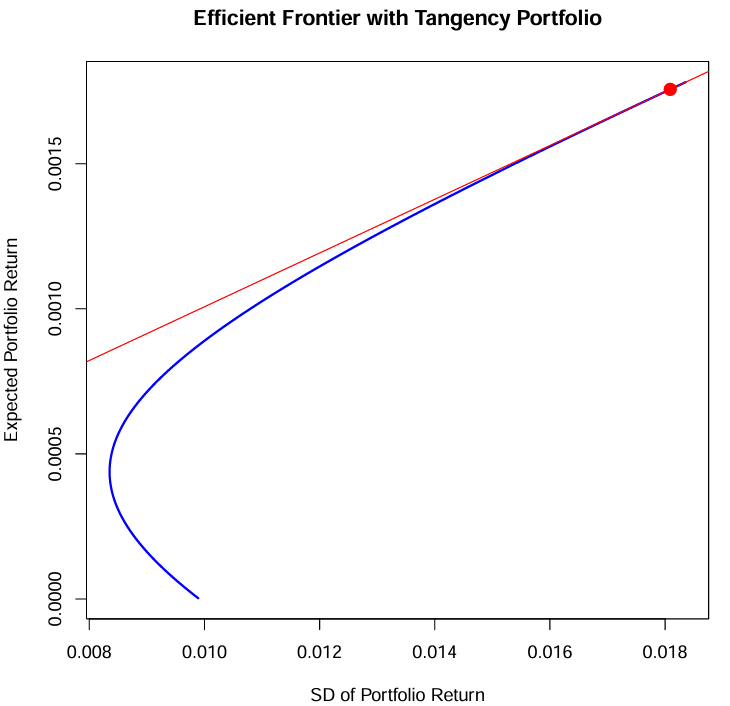

# 📉 Portfolio Risk Modeling and VaR Optimization in R

This repository presents the implementation of:

1. **Multivariate t-distribution modeling** of stock returns with profile likelihood estimation
2. **Minimum Value-at-Risk (VaR) portfolio optimization** using quadratic programming
3. Efficient frontier construction with and without **short-selling**
4. Tangency portfolio selection via **Sharpe ratio maximization**

> 📘️ Project created for EECS 545 at the University of Michigan.

---

## 📁 Files

| File                   | Description                        |
| ---------------------- | ---------------------------------- |
| `Multivariate-Risk-Modeling-and-Portfolio-Optimization.Rnw` | LaTeX + R analysis source          |
| `Multivariate-Risk-Modeling-and-Portfolio-Optimization.pdf` | Compiled project report            |
| `DowJones30.csv`       | 10-year DJIA stock log-return data |

---

## 1️⃣ Multivariate t-distribution and VaR Estimation

* Selected DJIA log-returns from 1990–2000
* Fit a multivariate **t-distribution** to the returns
* Estimated the degrees of freedom ν via **profile likelihood**:

```r
t.loglike <- function(dat, nu.range) {
  mu <- colMeans(dat)
  Sig <- cov(dat)
  sapply(nu.range, function(nu) {
    sum(log(dmt(dat, mean = mu, S = Sig * (nu - 2) / nu, df = nu)))
  })
}
```

* Estimated ν̂ = **7.25**
* 95% Confidence Interval for ν: **\[6.92, 7.6]**

### 📌 Value-at-Risk (VaR) Calculation

Calculated one-day VaR at 95% confidence level for an equal-weighted portfolio:

```r
VaR_95 <- qt(0.05, df = nu_hat) * sqrt(t(w) %*% S %*% w) + t(w) %*% mu
```

📊 **Result**:

* VaR₉₅ (daily) ≈ **1.49%**

---

## 2️⃣ Minimum VaR Portfolio Optimization

Used `quadprog::solve.QP()` to solve:

* **Objective**: minimize portfolio VaR (proxy via variance)
* **Constraints**:

  * Expected return = target `v`
  * Sum of weights = 1

### ⚖️ Optimization Function

```r
mu <- colMeans(ret)
Lambda <- cov(ret)
vs <- seq(0.001, 0.65, by = 0.001) / 365

optimization_weight <- function(vs) {
  sigmas <- numeric(length(vs))
  weights <- matrix(0, nrow = length(vs), ncol = ncol(ret))

  for (i in seq_along(vs)) {
    v <- vs[i]
    Dmat <- 2 * Lambda
    dvec <- rep(0, ncol(ret))
    Amat <- cbind(rep(1, ncol(ret)), mu)
    bvec <- c(1, v)
    res <- solve.QP(Dmat, dvec, Amat, bvec, meq = 2)
    weights[i, ] <- res$solution
    sigmas[i] <- sqrt(t(res$solution) %*% Lambda %*% res$solution)
  }

  list(sig = sigmas, weights = weights)
}

result <- optimization_weight(vs)
```

### 📈 Efficient Frontier Plot

```r
plot(result$sig, vs, type = "l", col = "blue",
     xlab = "Portfolio Std Dev", ylab = "Expected Return",
     main = "Efficient Frontier (with Short-Selling)")
```

### 📍 Tangency Portfolio via Sharpe Ratio

#### ✅ With Short-Selling Allowed


| Stock 1 | 2      | 3      | 4      | 5      | 6      | 7      | 8      | 9      | 10     |
|--------|--------|--------|--------|--------|--------|--------|--------|--------|--------|
| 0.1428 | -0.0020 | -0.3348 | -0.1563 | 0.0297 | 0.2052 | 0.1047 | -0.0480 | -0.1594 | 0.0936 |

| Stock 11 | 12     | 13     | 14     | 15     | 16     | 17     | 18     | 19     | 20     |
|---------|--------|--------|--------|--------|--------|--------|--------|--------|--------|
| 0.2490  | -0.1630 | 0.0073 | 0.1796 | 0.1235 | 0.1868 | -0.1406 | -0.2059 | 0.0814 | 0.1193 |

| Stock 21 | 22     | 23     | 24     | 25     | 26     | 27     | 28     | 29     | 30     |
|---------|--------|--------|--------|--------|--------|--------|--------|--------|--------|
| 0.0453  | 0.1498 | 0.1630 | 0.1078 | 0.0444 | -0.1219 | 0.1638 | 0.2164 | -0.0383 | -0.0432 |

---
#### ❌ No Short-Selling (Long-Only)



| Stock 1 | 2      | 3      | 4      | 5      | 6      | 7      | 8      | 9      | 10     |
|--------|--------|--------|--------|--------|--------|--------|--------|--------|--------|
| 0.0322 | 0.0000 | 0.0000 | 0.0000 | 0.0000 | 0.1114 | 0.0437 | 0.0000 | 0.0000 | 0.0686 |

| Stock 11 | 12     | 13     | 14     | 15     | 16     | 17     | 18     | 19     | 20     |
|---------|--------|--------|--------|--------|--------|--------|--------|--------|--------|
| 0.0804  | 0.0000 | 0.0000 | 0.0810 | 0.0374 | 0.0901 | 0.0000 | 0.0000 | 0.0324 | 0.0820 |

| Stock 21 | 22     | 23     | 24     | 25     | 26     | 27     | 28     | 29     | 30     |
|---------|--------|--------|--------|--------|--------|--------|--------|--------|--------|
| 0.0023  | 0.0692 | 0.0916 | 0.0000 | 0.0035 | 0.0000 | 0.0566 | 0.1175 | 0.0000 | 0.0000 |

---
```r
rf <- 0.0001  # daily risk-free rate
Sharpe <- (vs - rf) / result$sig
idx_tan <- which.max(Sharpe)
tan_weights <- result$weights[idx_tan, ]
```

### 📌 Result Summary

* Tangency portfolio expected return: **≈ 0.0165**
* Standard deviation (volatility): **≈ 0.0117**
* **Highest Sharpe ratio** achieved along the efficient frontier

---

